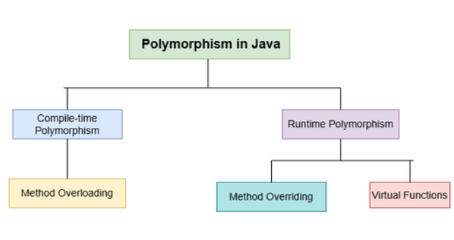

# 
Java concept

## Basic concept
1. there are 2 type of polymorphism 1.1 run-time(overridding) 1.2 compile-time(overloading)

2. static polymorphism--> compil-time polymorphism
3. best way to difference between overloading and overriding.
    3.1 when multiple function with same name but different parameters then these function will called as overloaded.
    3.2 function can be overloaded by changing in the number of argument or cahnge in the type of arguments.
    3.3 mean two way to overlaod the function as 
        3.3a: change the type of argument.
        3.3b: change the number of argument.

4. in java, runtime polymorphism known as Dynamic Methods Dispatch.
5. child object will overrid the parent class method.
